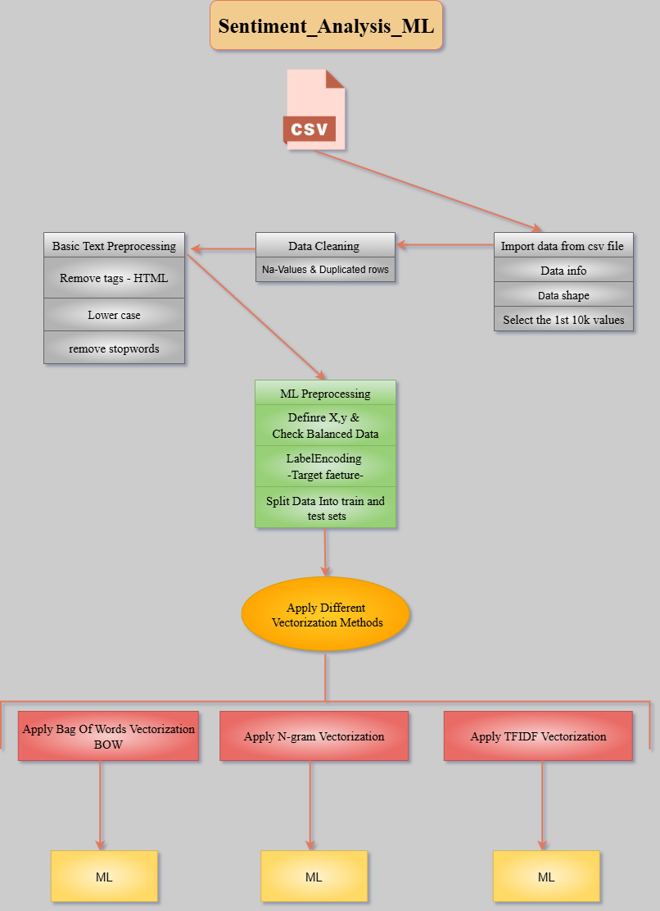

# *Sentiment_Analysis_ML*


## *How to run ?*

*Clone the repository:*

```bash
https://github.com/omars1234/Sentiment_Analysis_ML.git
```

```bash
conda create --name EnvTextCleaningNLP python=3.8.2 -y
```

```bash
conda activate EnvTextCleaningNLP
```

```bash
pip install -r requirements.txt
```

## *Project Structure :*


